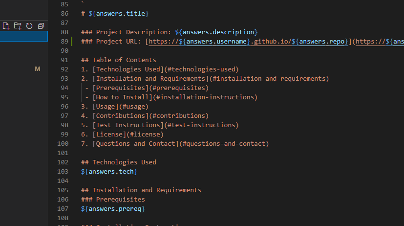

 
# README Creator

### Project Description: Creates simple READMEs for projects
### Project URL: [https://ericduwe.github.io/readmeCreator](https://ericduwe.github.io/readmeCreator)

## Table of Contents
1. [Technologies Used](#technologies-used)
2. [Installation and Requirements](#installation-and-requirements)
 - [Prerequisites](#prerequisites)
 - [How to Install](#installation-instructions)
3. [Usage](#usage)
4. [Contributions](#contributions)
5. [Test Instructions](#test-instructions)
6. [License](#license)
7. [Questions and Contact](#questions-and-contact)

## Technologies Used
JavaScript, node.js

## Installation and Requirements
### Prerequisites
undefined

### Installation Instructions
Install npm packages and clone repo

## Usage

## Contributions
This project is not open to outside contributions at this time.

## Test Instructions

## License
Distributed under the MIT License. See top of page for more information.

## Questions and Contact
If you have questions regarding this project, contact Eric Duwe at ericduwe@gmail.com, or find me on [github](https://www.github.com/ericduwe).
